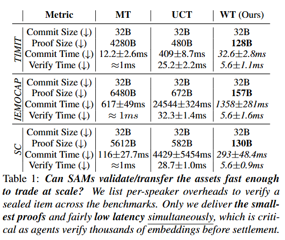

# WaveCommit

Repository for Interspeech 2026 Paper - WaveCommitments: Private and Verifiable Speech-Agent Marketplaces

## Podcast
https://github.com/user-attachments/assets/9e68040e-7195-42e0-aa32-07afa78cad33
## Overview


WaveCommit combines:
1. **Audio Embedding Extraction**: HuBERT-Large embeddings from TIMIT and IEMOCAP datasets
2. **Cryptographic Commitments**: TensorCommitment library for verifiable embedding pools
3. **Interpretability Analysis**: Captum TracIn and Shapley value computation per speaker/recording

## Project Structure

```
WaveCommit/
├── datasets/
│   ├── timit/                  # TIMIT speech corpus (16 speakers)
│   ├── iemocap/                # IEMOCAP emotional speech dataset
│   ├── speech_commands/        # Google Speech Commands v0.02 (keyword utterances)
│   └── DATASET_STRUCTURE.md
├── models/
│   ├── embedding_extractor/    # HuBERT/Wav2Vec2/Whisper backbone
│   ├── prediction_heads/       # SUPERB heads (ER, SID, KS, IC)
│   └── readme.md
├── libs/
│   ├── TensorCommitment/       # Cryptographic commitment library
│   │   ├── tensorCommitmentLib/  # PST tensor commitments (Rust)
│   │   ├── terkleLib/            # Multivariate Verkle tree
│   │   ├── merkle/               # Multi-branch Merkle tree
│   │   ├── CleanPegasus/         # Univariate KZG Verkle (pegasus_verkle)
│   │   ├── install.sh            # Build all commitment libs (maturin)
│   │   └── experiments/          # Benchmark & sweep scripts
│   └── captum/                 # Captum (interpretability)
├── scripts/
│   ├── verify_setup.py              # Environment verification
│   ├── download_models.py           # HuggingFace model download
│   ├── download_iemocap.py          # IEMOCAP dataset download
│   ├── download_speech_commands.py  # Speech Commands v0.02 download
│   ├── extract_embeddings.py        # HuBERT embedding extraction
│   ├── build_commitments.py         # Commitment tree building
│   ├── benchmark_commitment_pipeline.py  # PST + Merkle + CleanPegasus timing/size
│   ├── pst_build_speaker_commitment.py   # PST per-speaker commitment
│   ├── pst_verify_saved_proof.py         # PST proof verification
│   ├── captum_analysis.py          # Shapley/TracIn analysis (multi-GPU)
│   ├── visualize_captum.py         # Result visualization
│   ├── benchmark_pydvl_profiles.py         # pyDVL Data Shapley profiles
│   └── benchmark_pydvl_single_gpu_concurrency.py
├── tests/                      # Unit tests (e.g. test_data_shapley_pipeline)
├── assets/                     # Infographics, table_result, architecture
├── full_process.sh             # Automated full pipeline script
├── environment.yml             # Conda environment spec
├── pst_prove_and_verify_index.py   # PST prove/verify by index
├── benchmark_commitment_results.json
├── embeddings/                 # Extracted HuBERT embeddings per dataset
│   ├── timit/{speaker_id}/       # e.g. dr1-fvmh0; frame_embeddings.npy, utterance_embeddings.npy, metadata.json
│   ├── iemocap/{speaker_id}/     # e.g. Ses01_F; same layout
│   ├── speech_commands/{speaker_id}/
│   └── extraction_summary.json
├── commitments/                # Commitment trees per dataset (per-speaker + root)
│   ├── timit/
│   │   ├── commitment_summary.json
│   │   └── {speaker_id}/         # dr1-fvmh0, etc.
│   │       ├── commitment_metadata.json, commitment.txt
│   │       ├── pst_tensor/       # coefficients.json, hypercube.npy, proofs.json
│   │       └── pst_univariate/   # (where applicable)
│   ├── iemocap/                 # Ses01_F, Ses02_M, etc.; same layout
│   └── speech_commands/         # speaker hashes; same layout
├── analysis/                   # Captum results, bench_profiles, bench_single_gpu
├── progress.md
├── tests.md
└── README.md
```

## Environment Setup

```bash
# Create and activate conda environment from environment.yml
conda env create -f environment.yml
conda activate wavecommit

# Build commitment libraries in libs/TensorCommitment (Rust + maturin)
cd libs/TensorCommitment
./install.sh
cd ../..
```

## Reproduce Timing & Size Results

Run the benchmark for each dataset (per-speaker + root-level, PST + Merkle + CleanPegasus):

```bash
conda activate wavecommit

# TIMIT
python scripts/benchmark_commitment_pipeline.py --dataset timit

# IEMOCAP
python scripts/benchmark_commitment_pipeline.py --dataset iemocap

# Speech Commands
python scripts/benchmark_commitment_pipeline.py --dataset speech_commands
```

## Results



## Quick Start

### Option 1: Full Automated Pipeline
```bash
# Run entire pipeline from scratch
./full_process.sh

# Run from specific phase
./full_process.sh --phase 3

# Run specific step only
./full_process.sh --step 5.2
```

### Option 2: Manual Step-by-Step
```bash
# 1. Activate environment
conda activate wavecommit

# 2. Verify setup
python scripts/verify_setup.py

# 3. Extract embeddings (Phase 3, multi-GPU)
python scripts/extract_embeddings.py --dataset timit --output embeddings/ --num-gpus 8
python scripts/extract_embeddings.py --dataset iemocap --output embeddings/ --num-gpus 8
python scripts/extract_embeddings.py --dataset speech_commands --output embeddings/ --num-gpus 8

# 4. Build commitment trees (Phase 4)
python scripts/build_commitments.py --dataset timit
python scripts/build_commitments.py --dataset iemocap
python scripts/build_commitments.py --dataset speech_commands

# 5. Example - run interpretability analysis (Phase 5)
python scripts/captum_analysis.py --dataset timit --head er --analysis all --num-gpus 8

# 6. Example - Run Data Shapley (utterance-level attribution)
# Default: fine-tune pretrained matching head (auto -> sid for SID analysis)
python scripts/captum_analysis.py --dataset timit --head sid --analysis data_shapley --num-gpus 8 --pydvl-model finetune_head --pydvl-feature-head auto --pydvl-train-device cuda --pydvl-jobs 1
# IEMOCAP ER task with full emotion label set from metadata
python scripts/captum_analysis.py --dataset iemocap --head er --analysis data_shapley --num-gpus 8 --pydvl-model finetune_head --pydvl-feature-head auto --pydvl-train-device cuda --pydvl-jobs 1 --pydvl-task emotion
# tqdm/ETA is enabled by default for pyDVL TMC-Shapley (disable with --disable-pydvl-tqdm)

# Optional: run both datasets with outer tqdm progress
# - TIMIT uses SID labels
# - IEMOCAP uses full ER emotion labels
./full_process.sh --step 6.2.6

# Optional: benchmark experimental single-GPU pyDVL subset-fit concurrency
python scripts/benchmark_pydvl_single_gpu_concurrency.py \
  --dataset iemocap --head er --pydvl-task emotion \
  --jobs-list 1,2,4 --pydvl-joblib-backend auto \
  --output-root analysis/captum_bench_single_gpu

# Optional: run recommended benchmark profile grids (multi-GPU)
python scripts/benchmark_pydvl_profiles.py \
  --profile safe --dataset iemocap --head er --pydvl-task emotion \
  --output-root analysis/captum_bench_profiles
python scripts/benchmark_pydvl_profiles.py \
  --profile aggressive --dataset iemocap --head er --pydvl-task emotion \
  --output-root analysis/captum_bench_profiles

# Optional: same benchmark/profile flow for other dataset/head settings
# IEMOCAP SID (speaker labels)
python scripts/benchmark_pydvl_profiles.py \
  --profile safe --dataset iemocap --head sid --pydvl-task speaker \
  --output-root analysis/captum_bench_profiles
# TIMIT SID (speaker labels)
python scripts/benchmark_pydvl_profiles.py \
  --profile safe --dataset timit --head sid --pydvl-task speaker \
  --output-root analysis/captum_bench_profiles
# TIMIT ER (speaker labels in this pipeline)
python scripts/benchmark_pydvl_profiles.py \
  --profile safe --dataset timit --head er --pydvl-task speaker \
  --output-root analysis/captum_bench_profiles

# Optional frozen-head pyDVL model (kept for comparison/reliability checks)
python scripts/captum_analysis.py --dataset timit --head sid --analysis data_shapley --pydvl-model frozen_head_top --pydvl-feature-head sid

# Legacy sklearn pyDVL model (for comparison/reliability checks)
python scripts/captum_analysis.py --dataset timit --head sid --analysis data_shapley --pydvl-model legacy_sklearn_mlp

# 7. Generate visualizations
python scripts/visualize_captum.py --analysis-dir analysis/captum/er
python scripts/visualize_captum.py --analysis-dir analysis/captum/sid
# Optional: generate only Data Shapley plots into isolated "latest" folders
python scripts/visualize_captum.py --analysis-dir analysis/captum/er --output-dir analysis/captum/er/visualizations/latest_data_shapley --data-shapley-only
python scripts/visualize_captum.py --analysis-dir analysis/captum/sid --output-dir analysis/captum/sid/visualizations/latest_data_shapley --data-shapley-only
```

## Multi-GPU Support

Both embedding extraction and Captum analysis support multi-GPU parallelization:

```bash
# Auto-detect and use up to 8 GPUs (default)
python scripts/extract_embeddings.py --dataset iemocap --num-gpus 8

# Force single GPU mode
python scripts/extract_embeddings.py --dataset timit --single-gpu
```

### Performance (8xGPU)
| Task | Dataset | Single GPU | 8 GPUs | Speedup |
|------|---------|------------|--------|---------|
| Embedding Extraction | TIMIT (160 samples) | ~2 min | ~33s | 4x |
| Embedding Extraction | IEMOCAP (10,039 samples) | ~10 min | ~170s | 4x |
| Integrated Gradients | IEMOCAP | ~4 min | ~30s | 8x |
| Data Shapley | IEMOCAP | ~15 min | ~2 min | 8x |

## Interpretability Analysis Types

### Feature-level Shapley (`--analysis shapley`)
- Computes importance of each **feature** (1024 dimensions) for a prediction
- Output: 1024 Shapley values per utterance
- Answers: "Which embedding dimensions are important?"

### Data Shapley (`--analysis data_shapley`)
- Computes importance of each **utterance as a data point**
- Output: 1 Shapley value per utterance
- Two types:
  - **Intra-speaker**: Leave-one-out influence within the speaker
  - **Inter-speaker**: Contribution to speaker separation

#### pyDVL Data Shapley Modes
- Default: `--pydvl-model finetune_head`
  - Starts from pretrained SUPERB head weights (`--pydvl-feature-head auto`, default)
  - `--pydvl-feature-head auto` resolves to the active `--head` (`sid` for SID runs, `er` for ER runs)
  - Fine-tunes `projector (1024->256)` + adapted `classifier (256->num_target_groups)` on each pyDVL subset
  - Stability-first defaults:
    - `--min-updates 200`
    - `--rtol 0.03` (stricter truncation tolerance)
  - Use `--pydvl-train-device cuda --pydvl-jobs 1` for stable default GPU mode
  - For faster exploratory runs, explicitly lower `--min-updates` and/or increase `--rtol`
  - Optional one-class subset mitigation:
    - `--pydvl-enforce-multiclass-subsets`
    - Augments one-class pyDVL subset fits with anchor samples from a different class
    - This reduces degenerate one-class fits but modifies standard TMC-Shapley estimator behavior
  - Single-GPU concurrent subset fits are experimental:
    - set `--pydvl-jobs > 1 --pydvl-allow-single-gpu-concurrency`
    - choose backend with `--pydvl-joblib-backend auto|loky|threading`
  - pyDVL TMC-Shapley tqdm progress/ETA is enabled by default (`--disable-pydvl-tqdm` to disable)
  - Target task labels are controlled by `--pydvl-task`:
    - `auto`: IEMOCAP+ER uses full emotion labels; otherwise speaker labels
    - `speaker`: force speaker-ID labels
    - `emotion`: force emotion labels (IEMOCAP only)
  - Speaker-clustered artifacts are also saved from the train split (for both task modes):
    - `data_shapley/train_speaker_ids.npy`
    - `data_shapley/speaker_label_contributions/{label_or_speaker}/{speaker_id}/pydvl_data_shapley.npy`
    - `pydvl_data_shapley_summary.json` includes `speaker_label_contributions` stats per `(label_or_speaker, speaker_id)` bucket
- Optional: `--pydvl-model frozen_head_top`
  - Uses fixed pretrained head features and trains only a top classifier
- Legacy: `--pydvl-model legacy_sklearn_mlp`
  - Previous sklearn MLP over raw 1024-d embeddings
  - Kept for reliability comparison against the default mode
- Benchmark profile helper:
  - `scripts/benchmark_pydvl_profiles.py` provides recommended `safe` and `aggressive` sweeps for multi-GPU environments

#### Data Shapley Visualization
- Run:
  - `python scripts/visualize_captum.py --analysis-dir analysis/captum/sid`
- Theme:
  - seaborn `darkgrid` (default in `visualize_captum.py`)
- Technical report:
  - `analysis/captum/sid/visualizations/README.md`
- Generated files (when `data_shapley/pydvl_data_shapley_summary.json` exists):
  - `data_shapley_speaker_stats.png`
  - `data_shapley_distribution.png`
  - `data_shapley_top_bottom_samples.png`
  - `data_shapley_heatmap.png`

## Datasets

### TIMIT
- Located at: `datasets/timit/`
- Structure: `dr{1-8}-{speaker_id}/` (dialect region + speaker)
- Files per speaker: `.wav`, `.txt`, `.phn`, `.wrd`

### IEMOCAP
- Source: `huggingface.co/datasets/AbstractTTS/IEMOCAP`
- Download required via HuggingFace datasets API

### Speech Commands
- Source: `google/speech_commands` (v0.02), downloaded via `scripts/download_speech_commands.py`
- Located at: `datasets/speech_commands/v0.02/`
- One-second keyword utterances; speakers identified by `speaker_id` in filenames

## Models

| Model | Purpose | HuggingFace ID |
|-------|---------|----------------|
| HuBERT-Large | Embedding backbone | `facebook/hubert-large-ll60k` |
| Wav2Vec2 | Embedding backbone | `facebook/wav2vec2-large` |
| Whisper | Embedding backbone | `openai/whisper-base` |
| ER Head | Emotion Recognition | `superb/hubert-large-superb-er` |
| SID Head | Speaker Identification | `superb/hubert-large-superb-sid` |
| KS Head | Keyword Spotting | `superb/hubert-large-superb-ks` |
| IC Head | Intent Classification | `superb/hubert-large-superb-ic` |

## Requirements

- Python 3.10+
- CUDA-capable GPU (recommended)
- Rust toolchain (for TensorCommitment library)
- ~10GB disk space for models and embeddings

## Citation

```bibtex
@inproceedings{wavecommit2026,
  title={WaveCommitments: Private and Verifiable Speech-Agent Marketplaces},
  booktitle={Interspeech},
  year={2026},
  note={Submitted; under review}
}
```
