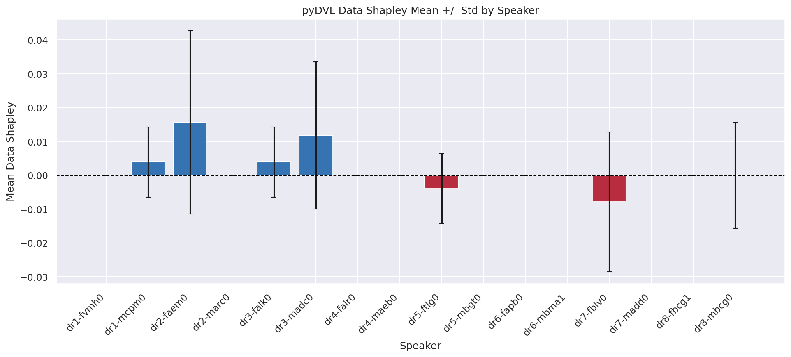
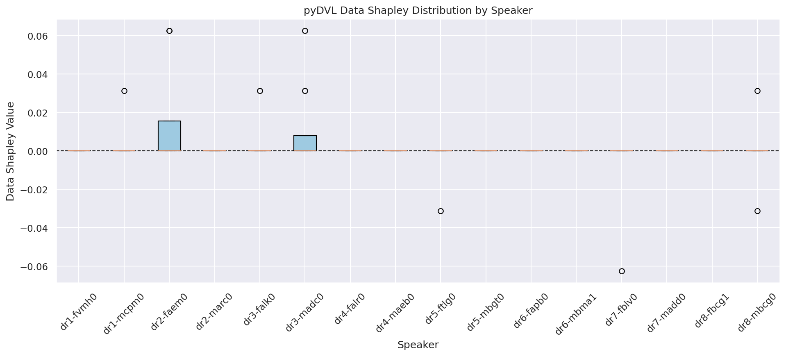
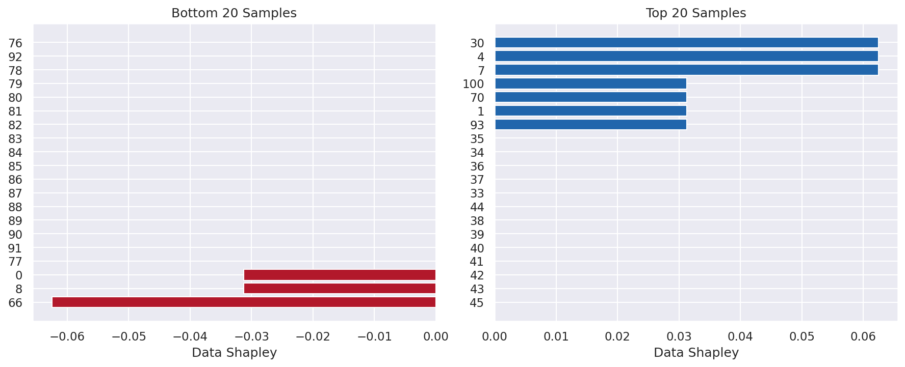
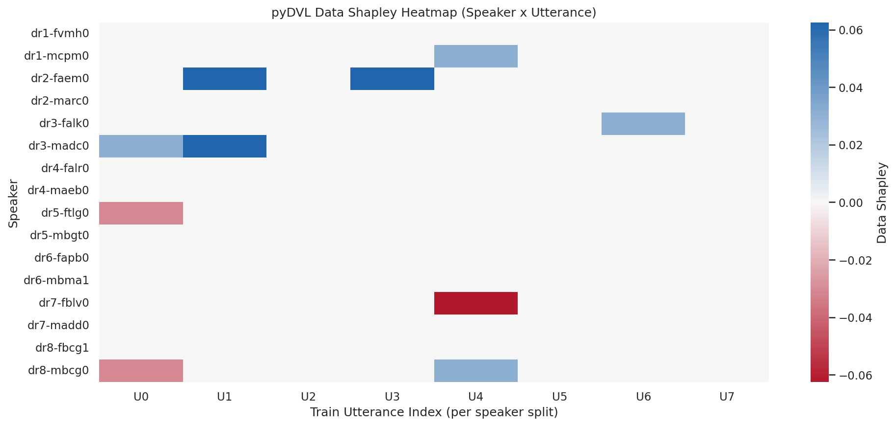

# TIMIT SID Data Shapley Technical Report

This report summarizes pyDVL TMC-Shapley results for TIMIT speaker identification with the `finetune_head` setup.

## Run Context

- Dataset: TIMIT
- Task: Speaker Identification (SID)
- Data Shapley method: pyDVL TMC-Shapley
- Model type: `finetune_superb_projector_classifier`
- Train samples: 128 (16 speakers x 8 train utterances per speaker)
- Test samples: 32
- Global Data Shapley mean: `0.00146484375`
- Global std: `0.0017146390823`
- Value range: `[-0.003125, 0.00625]`
- Quantiles: Q1 `0.0003125`, median `0.00109375`, Q3 `0.0025`

## 1) Speaker-Level Mean +/- Std

Question:
Do different speaker groups contribute equally to generalization utility?

Hypothesis:
If contribution is heterogeneous, speaker-level means will vary substantially, and at least one group may be net-negative.

Observation:
Speaker mean Data Shapley values span from `-0.000664` to `0.003711` (range `0.004375`).
Top means: `dr4-falr0=0.003711`, `dr3-madc0=0.003477`, `dr7-fblv0=0.003398`.
Lowest mean: `dr8-mbcg0=-0.000664`.
The highest positive mean is `5.59x` the absolute magnitude of the most negative mean.

Conclusion:
Data utility is not uniform across speaker groups.
This pattern generalizes to future experiments: aggregate-value analysis should include group-level decomposition to avoid masking underperforming or harmful cohorts.

## 2) Per-Speaker Distribution of Data Shapley

Question:
Are most training utterances beneficial, and how heavy-tailed is the utility distribution?

Hypothesis:
Most utterances should be positive contributors, with a non-trivial negative tail.

Observation:
Across all 128 train samples, `76.56%` are positive, `18.75%` negative, and `4.69%` exactly zero.
Median is positive (`0.001094`) and interquartile mass is also positive (`[0.0003125, 0.0025]`).
Within-speaker dispersion is non-negligible (speaker std range: `0.000540` to `0.001607`).

Conclusion:
The training pool is net-beneficial but contains a measurable harmful subset.
This is scientifically portable to other datasets: selection and weighting policies should account for the full signed distribution, not only average utility.

## 3) Top/Bottom Sample Ranking

Question:
Do a small number of samples dominate positive and negative marginal utility?

Hypothesis:
Utility should be tail-driven, with a sparse set of high-leverage positive and negative samples.

Observation:
Top sample value is `0.00625`, bottom is `-0.003125`, yielding a total extreme spread of `0.009375`.
Top-20 mean is `0.004375`, while bottom-20 mean is `-0.000734`.
Top extreme magnitude is `3.65` global standard deviations, bottom extreme is `1.82` standard deviations.

Conclusion:
A relatively small subset carries disproportionate utility signal.
For future experiments, this supports active-data strategies (retain top contributors, audit bottom contributors) under fixed labeling budgets.

## 4) Speaker x Utterance Heatmap

Question:
Is utility structure random, or does it exhibit stable interaction patterns across speaker and utterance index?

Hypothesis:
If interaction structure exists, heatmap rows/columns will show systematic variation rather than independent noise.

Observation:
Heatmap matrix is `16 x 8` (speakers x train utterances).
All column means are positive (`0.001113` to `0.001797`), but column variability differs: highest cross-speaker std at index `2` (`0.002237`) and lowest at index `5` (`0.001335`).
The map contains both positive and negative cells, indicating context-dependent utility inside each speaker group.

Conclusion:
Utility is structured across both speaker identity and sample position.
Generalizable implication: future pipelines should preserve group/sample indexing to enable interaction-aware curation and stability diagnostics across splits.

## Scientific Takeaways for Future Experiments

1. Always report signed utility, dispersion, and tail metrics together.
2. Analyze contributions at multiple resolutions: global, group-level, and sample-level.
3. Treat negative-valued samples as actionable diagnostics, not noise.
4. Validate whether observed utility structure remains stable across random splits, model variants, and datasets.
